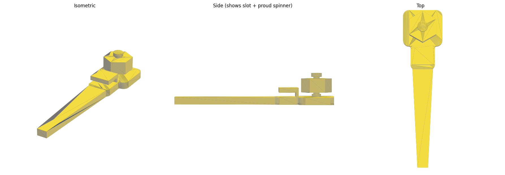

# Hexagon Fidget Clip Bookmark — for Bambu Lab P1S

A **classic clip-on bookmark** with a fidget:

- a slim tapered **blade** that slides down between the pages,
- a **sleeve / slot clip** near the top that grips the page edge,
- a decorative **head** carrying one **print-in-place hexagon spinner** that
  stands proud of the face and spins on an axis perpendicular to the blade
  ("facing out"), held captive by a mushroom cap.

Prints as **one piece, flat on the bed, no supports, no assembly.** The spin
axis is vertical, so the spinner is a clean print-in-place; the clip's outer
plate bridges a short slot.



- **Size:** ~26 mm wide head, ~105 mm long, blade 70 mm. Blade ~1.6 mm thin.
- **Slot:** 1.0 mm (grips a cover/page edge). **Clearance:** 0.40 mm (free spin).
- **Material:** PLA. Spinner cap stands ~6.8 mm proud of the head.

## Files

| File | What it is |
|------|------------|
| `hexagon_clip_bookmark.stl` | The clip bookmark with the print-in-place hex spinner. |
| `flat_clip_bookmark.stl` | Same clip, but with a flat engraved hexagon instead of a spinner (no moving parts — the safe fallback). |
| `generate_bookmark.py` | Parametric generator — change blade length, slot, clearance, spinner size, etc. and re-run. |
| `preview.png` | 3-view render (note the side view: blade + raised slot clip + proud spinner). |

## Print settings (Bambu Studio / Orca, P1S, 0.4 mm nozzle)

**Orientation:** lay it **flat on the plate exactly as the STL loads** — blade
face down, spinner pointing up (+Z). Do **not** rotate it; that keeps the
spinner a clean print-in-place and the clip slot a short bridge. **No supports.**

1. **Layer height:** 0.20 mm (0.16 mm = smoother spin).
2. **Walls:** 2–3. **Top/bottom layers:** 4. **Infill:** 15 % gyroid.
3. **Seam → `Aligned`**, and **paint the seam onto the head/body, never onto the
   spinner disc.** A fat seam on the disc is the #1 reason a print-in-place
   fidget won't spin.
4. **Bridging:** the clip's outer plate bridges the ~11 mm slot. Keep part
   cooling high (PLA: fan ~100 % over bridges — the P1S handles this span well).
   If the underside looks rough, that's fine — it's the inside of the clip.
5. **First layer:** keep it clean, not over-squished. A fat first layer can
   close the bottom of the spinner gap and fuse it — if your first layer is
   squishy, nudge Z-offset up a hair or drop flow ~2 %.
6. **Brim:** usually not needed. Add a 3 mm brim only if the thin blade tip lifts.

**After printing:** twist the spinner firmly to crack any stringing — it frees
up and spins. Flex the clip open once to make sure the slot didn't fuse.

### Tuning (edit the top of `generate_bookmark.py`, then re-run)

- **Spinner stuck:** raise `CLR` to `0.45`–`0.50` (and fix the disc seam first).
- **Spinner loose/wobbly:** lower `CLR` to `0.30`.
- **Clip too loose / won't grip:** lower `SLOT` to `0.6`–`0.8`.
- **Clip slot fused shut:** raise `SLOT` to `1.2` and/or shorten `CLIP_LEN`.
- **Blade longer/shorter or wider:** `BLADE_LEN`, `BLADE_W`, `TIP_W`.
- **Bigger/smaller fidget:** `DISC_R`, `DISC_T`. Add a tassel hole: set `TASSEL_R = 2.5`.

## Regenerating

```bash
pip install numpy manifold3d trimesh
python3 generate_bookmark.py
```

## Existing models to compare (you asked for "both")

These aren't clip bookmarks, but they're proven print-in-place hex fidgets —
handy if you want a reference spinner or just a quick separate fidget. Several
ship ready-made P1S profiles:

- [Hexagon Fidget — Print In Place (3D-Printing Nerds)](https://makerworld.com/en/models/1005807-hexagon-fidget-print-in-place)
- [Hexagon Gyro Card Fidget — Print in Place](https://makerworld.com/en/models/1407430-hexagon-gyro-card-fidget-print-in-place)
- [Hexagon Gyro — Fidget Spinner — Print In Place](https://makerworld.com/en/models/823168-hexagon-gyro-fidget-spinner-print-in-place)
- [Print in Place Fidget Spinner (Printables)](https://www.printables.com/model/186682-print-in-place-fidget-spinner)

> Community tip for any print-in-place spinner on Bambu machines: watch the
> **seam** — a large seam can weld the spinner to the body and stop it spinning.
> Paint the seam onto the body, not the moving disc.
