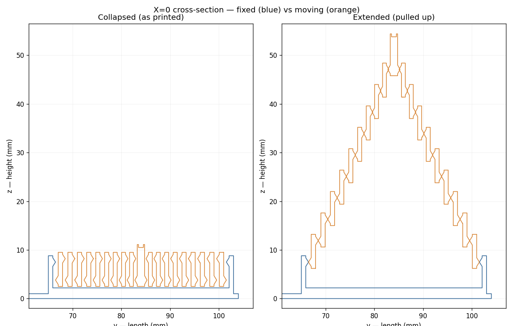

# Hexagon Telescoping-Vortex Bookmark — for Bambu Lab P1S

A flat **clip bookmark** with a print-in-place **telescoping hexagon vortex** on top
(rebuilt to match the reference photos — a nested-ring collapsing cone, not a single knob).

- **Body:** a flat **1 mm** decorative bookmark — an **outer outline (frame)** with an
  **inner tongue**, separated by two side slots. Thread a page through the slots to clip
  it on. The top widens into a round **"lollipop" head** (~40 mm) that carries the fidget.
- **Top fidget:** ~10 **concentric hexagonal rings** nested inside one another. It prints
  **collapsed and flat** (~11 mm tall — looks like concentric spiral hexagons). **Pull the
  centre** and it **telescopes up** into a **tapering, twisting cone** (~50 mm tall), then
  pushes back down flat. Each ring is **captured** by the one outside it, so it can never
  pull apart. A gentle per-ring twist makes the corners spiral — the **vortex** look.

Prints as **one piece, flat on the bed, no supports, no assembly.**


X=0 cross-section — collapsed (as printed) vs extended (pulled up):



- **Size:** 24 mm strap / **40 mm head** × ~104 mm, body 1 mm thick. Vortex ~11 mm collapsed, **~50 mm extended**.
- **Clearance:** 0.30 mm flat (comb-tuned). **Capture lip:** 0.22 mm. **Slots:** 1.8 mm.
- **Material:** PLA.

## Files

| File | What it is |
|------|------------|
| `hexagon_telescope_bookmark.stl` | The bookmark + print-in-place telescoping vortex. |
| `flat_clip_bookmark.stl` | Same lollipop clip body with a flat engraved spiral hexagon (no moving parts — safe fallback). |
| `fidget_test_coupon.stl` | One small vortex on a round base — quick mechanism test. |
| `clearance_test_comb.stl` | Five small vortexes at **0.20 / 0.25 / 0.30 / 0.35 / 0.40 mm** clearance, marked **1–5 dots**. |
| `generate_bookmark.py` | Parametric generator (source of truth). |
| `generate_tests.py` | Test coupon + clearance comb (reuse the same `vortex_rings` builder). |
| `render_preview.py` | matplotlib 3-view + X=0 cross-section renders. |
| `preview.png`, `preview_section.png` | Renders. |

## How the vortex is captured (so it can't fall apart)

Each ring is a thin hex tube with two interlocking chevrons:

```
   ring k-1 (outer) ───┐         ┌─── ring k (inner)
        wall           │  \ /    │   inward NECK chevron (the stop) at the top
                       │   ▲     │   pinches the bore to (ri - CATCH)
            gap (CLR) →│  / \    │
                       │   ▼     │   outward FOOT chevron (the catch) at the base
        wall           │  / \    │   bulges the wall to (ro + CATCH)
```

Pull a ring up and its **foot** (wider than the next ring's **neck** hole by the 0.22 mm
lip) wedges under that neck — a hard stop, so it can't escape. Because the catch radii sit
at the **centre** of each chevron, the foot and neck actually meet when pulled (a simple
base/top taper would slip past). All chevron faces are gentle ~30° overhangs → self-supporting.

**The generator proves both properties every run:**
- every adjacent ring pair has **~0 mm³** boolean intersection when collapsed (won't fuse in the print), and
- each ring shows a **solid interference at peak engagement** (it's captured, can't pull off).

## Test print first (recommended — a few minutes)

Print-in-place success depends on your machine's calibration, so validate the fit first:

1. Print **`clearance_test_comb.stl`** (five small vortexes, **0.20→0.40 mm**, marked 1→5 dots).
2. Push each centre down, then pull it up. Pick the **loosest clearance that still pops up
   captive and doesn't rattle sideways.** (More clearance = looser/easier; less = tighter/snappier.)
3. Set `CLR` in `generate_bookmark.py` to that value, re-run, and print `hexagon_telescope_bookmark.stl`.

> Note: clearance also sets the **ring count** — tighter clearance packs more rings (a busier
> vortex), looser packs fewer. The default 0.30 mm gives ~10 rings.

## Print settings (Bambu Studio / Orca, P1S, 0.4 mm nozzle)

**Orientation:** load the STL **as-is, flat on the plate** (body down, vortex up). Do **not** rotate. **No supports.**

1. **Layer height:** 0.20 mm (0.16 mm = silkier telescope).
2. **Walls:** 2–3. **Top/bottom:** 4. **Infill:** 15 %.
3. **Seam → `Aligned`**, and **paint the seam onto the fixed base / outer ring, not the moving
   rings** — a fat seam blob across a gap is the usual cause of a seized fidget.
4. **First layer clean, not over-squished:** the moving rings float 0.3 mm above the base
   floor; a fat first layer can fuse them. If your first layer is squishy, nudge Z-offset up a
   hair or drop flow ~2 %.
5. The chevrons are **self-supporting** (~30° faces) — no supports needed.
6. **Brim:** not needed (good flat footprint), but a 3 mm brim helps if the head lifts.

**After printing:** push the centre all the way down, then pull it up firmly once to crack
any stringing between rings — it then telescopes freely.

### Tuning (edit the top of `generate_bookmark.py`, then re-run)

- **Rings stuck together:** raise `CLR` (looser) and fix the seam first.
- **Rings rattle / fall slack:** lower `CLR` (tighter), or raise `CAP` for a deeper catch.
- **More / fewer rings:** lower / raise `CLR`, or change `R_OUT` (head size) and `WALL`.
- **More vortex spin:** raise `TWIST_SAFE` (it auto-limits per ring so it can't bind).
- **Taller pop-up:** raise `RING_H` (more travel per ring).
- **Bigger / smaller head:** `R_OUT` + `HEAD_D`. **Longer / shorter bookmark:** `SLOT_TOP`, `SLOT_BOT`, `HEAD_CY`, `W`, `TONGUE_W`.

## Regenerating

```bash
pip install numpy manifold3d trimesh matplotlib scipy shapely rtree
python3 generate_bookmark.py     # the bookmark + flat fallback (+ verification)
python3 generate_tests.py        # coupon + clearance comb
python3 render_preview.py        # preview.png + preview_section.png
```
